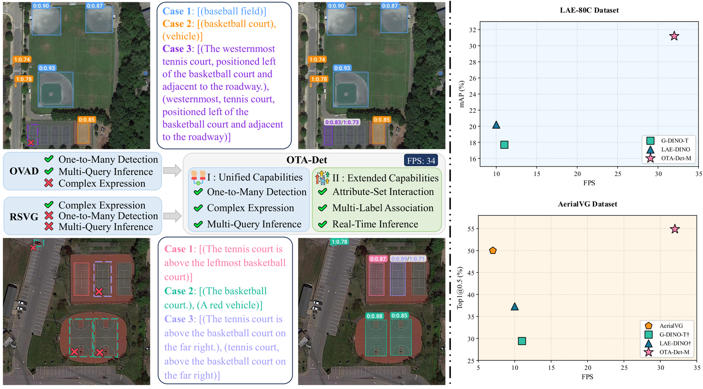
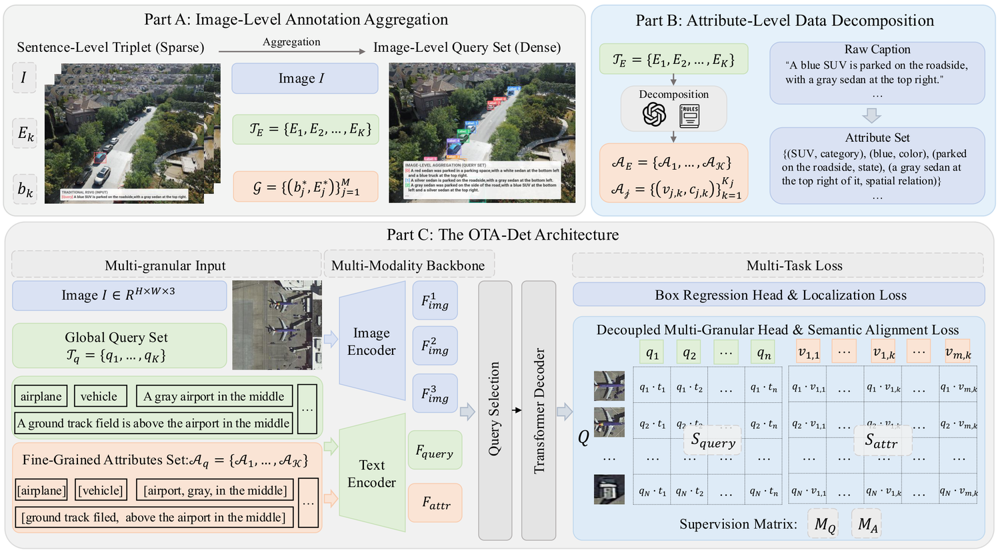
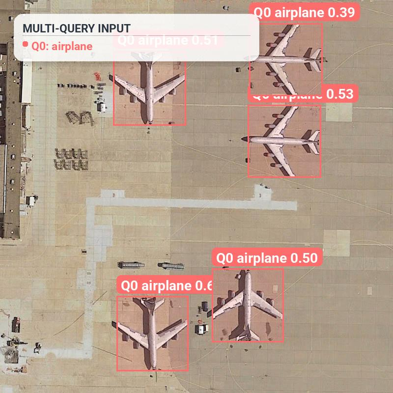
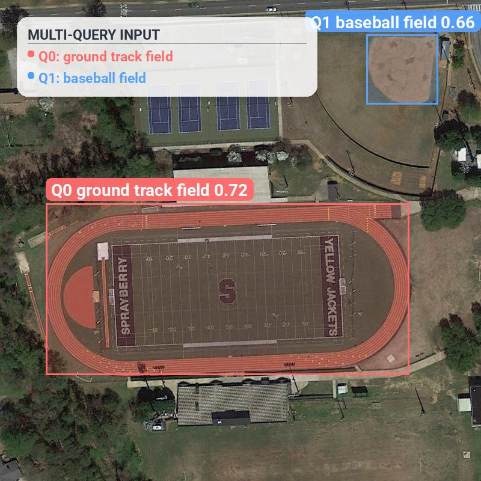
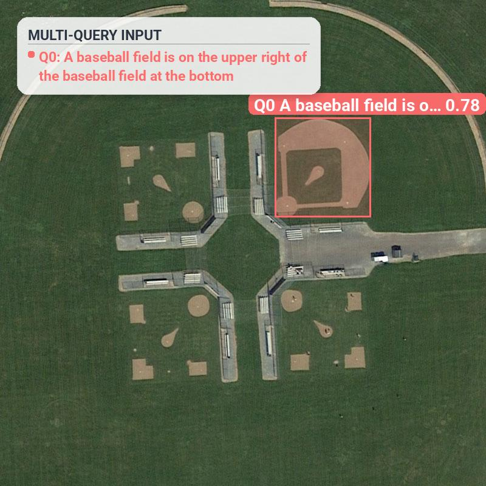
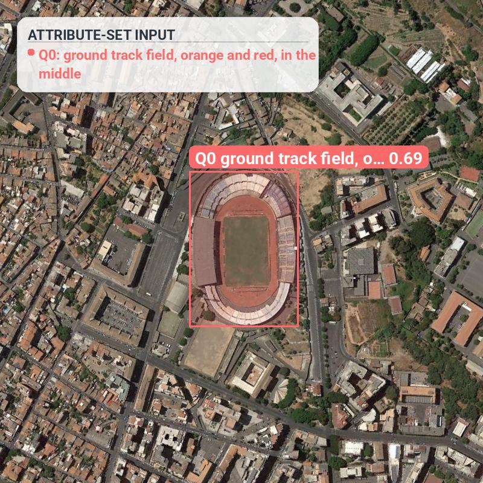
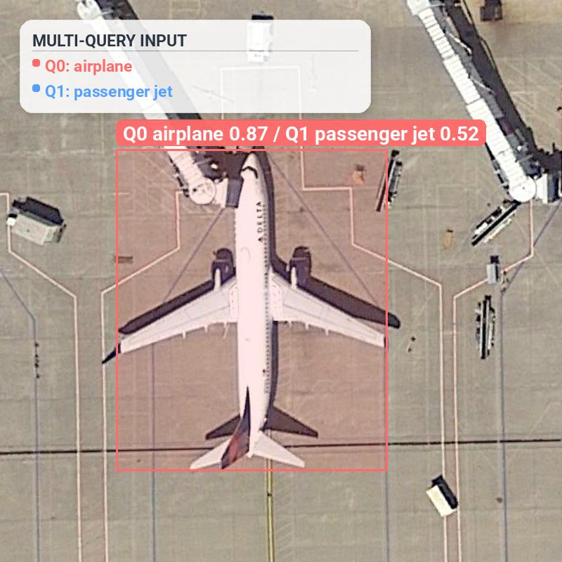
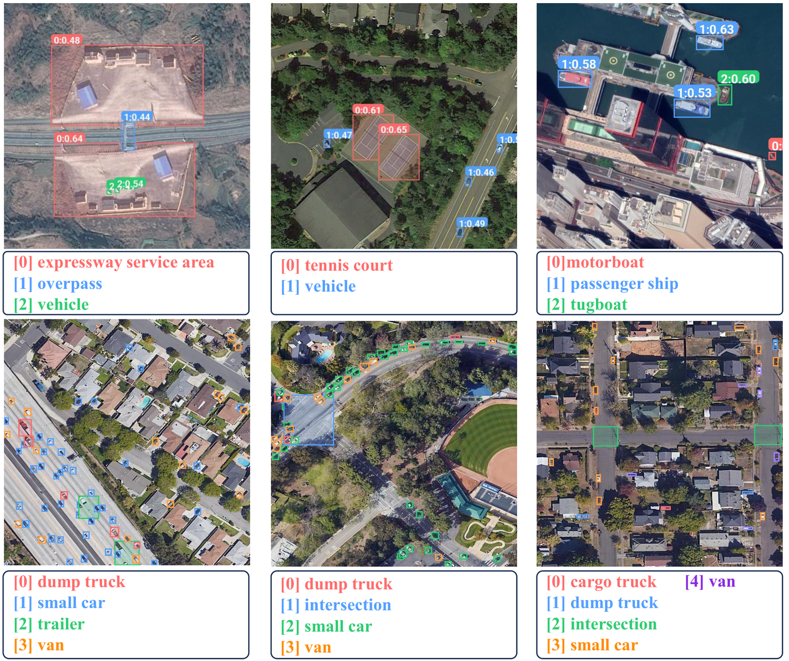
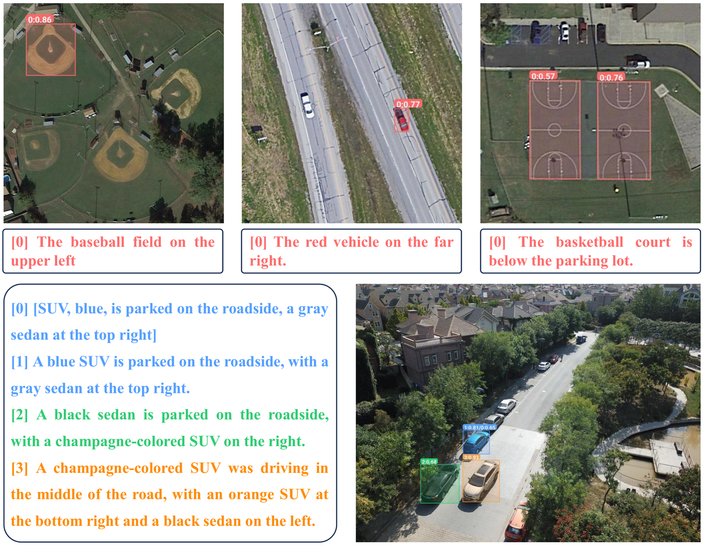

<div align="center">

# OTA-Det: Open-Text Aerial Detection

**A Unified Framework for Aerial Visual Grounding and Detection**

Guoting Wei<sup>1,4,&ast;</sup>, Xia Yuan<sup>1,&ast;</sup>, Yang Zhou<sup>2</sup>, Haizhao Jing<sup>2</sup>, Yu Liu<sup>3</sup>, Xianbiao Qi<sup>4</sup>,<br>Chunxia Zhao<sup>1</sup>, Haokui Zhang<sup>2,4,†</sup>, Rong Xiao<sup>4</sup>

<sup>&ast;Equal contribution&nbsp;&nbsp;†Corresponding author</sup>

<sup>1</sup>Nanjing University of Science and Technology&nbsp;&nbsp;<sup>2</sup>Northwestern Polytechnical University&nbsp;&nbsp;<sup>3</sup>Zhejiang Lab&nbsp;&nbsp;<sup>4</sup>Intellifusion

<em>ICML 2026</em>

[](https://arxiv.org/abs/2602.07827)
[](https://github.com/GT-Wei/OTA-Det)
[](assets/poster_ota.pdf)
[](LICENSE)

</div>

<p align="center">
  
</p>

## Overview

Open-Vocabulary Aerial Detection (OVAD) and Remote Sensing Visual Grounding (RSVG) are usually treated as separate tasks. OVAD supports one-to-many category detection but only uses coarse category-level text, while RSVG handles complex referring expressions but is commonly restricted to single-target localization.

OTA-Det reformulates both tasks as open-text aerial detection. A single model accepts category names, referring expressions, or multiple prompts at once, and predicts all matching aerial targets. The code is based on DEIMv2 / RT-DETR and adds the OTA-Det multi-modal backbone, dense semantic alignment losses, and a decoupled multi-granular head.

<p align="center">
  
  <br>
  <em>OTA-Det framework: Image-Level Annotation Aggregation, Attribute-Level Data Decomposition, and the Decoupled Multi-Granular Head.</em>
</p>

## Main Results

The main paper results use joint training on OTA-Mix: LAE-1M + OPT-RSVG + DIOR-RSVG + AerialVG. FPS is measured on a single RTX 4090 with offline text encoding.

| Model | FPS | DIOR AP50 | DOTA mAP | LAE-80C mAP | OPT-RSVG Acc@0.5 | DIOR-RSVG Acc@0.5 | AerialVG Acc@0.5 |
|:--|:--:|:--:|:--:|:--:|:--:|:--:|:--:|
| OTA-Det-S | **34** | 91.9 | 48.0 | 29.2 | 85.0 | 82.7 | 49.2 |
| OTA-Det-M | 32 | 91.8 | 49.4 | 28.8 | 85.2 | 83.8 | 51.7 |
| OTA-Det-L | 28 | **93.1** | **52.0** | **31.0** | **86.5** | **85.1** | **53.9** |

## Installation

```bash
git clone https://github.com/GT-Wei/OTA-Det.git
cd OTA-Det

conda create -n otadet python=3.11 -y
conda activate otadet
pip install -r requirements.txt
```

Core dependencies include `torch>=2.5.1`, `torchvision>=0.20.1`, `transformers`, `open_clip_torch`, `faster-coco-eval`, `datasets`, `geomloss`, `calflops`, `opencv-python-headless`, `tqdm`, `openai`, and `einops`.

## Weights

OTA-Det uses a DINOv3-STAs image encoder and a frozen SigLIP2 text encoder. Put backbone/text weights under `./ckpts/` as referenced by the YAML configs:

```text
ckpts/
├── vitt_distill.pt
├── vittplus_distill.pt
├── dinov3_vits16_pretrain_lvd1689m-08c60483.pth
└── ViT-B-16-SigLIP2-512/
    ├── open_clip_config.json
    ├── open_clip_model.safetensors
    ├── tokenizer.json
    ├── tokenizer_config.json
    └── special_tokens_map.json
```

Download the DINOv3 checkpoints from the official [DINOv3 repository](https://github.com/facebookresearch/dinov3). The distilled ViT-Tiny and ViT-Tiny+ checkpoints follow the upstream DEIMv2 links in `README_DEIM.md`. Download the SigLIP2 OpenCLIP files from [timm/ViT-B-16-SigLIP2-512](https://huggingface.co/timm/ViT-B-16-SigLIP2-512) and keep the directory layout above. Missing backbone/text weights will make the corresponding encoder initialize from scratch, so verify these files before training or evaluation.

OTA-Det-Weights:

| Paper model | Config | Checkpoint name | Download |
|:--|:--|:--|:--|
| OTA-Det-S | `configs/OTA-Det/OTA-Det-S/OTADet_dinov3_s_OTAMix.yml` | `OTADet_dinov3_s_OTAMix.pth` | To be released |
| OTA-Det-M | `configs/OTA-Det/OTA-Det-M/OTADet_dinov3_m_OTAMix.yml` | `OTADet_dinov3_m_OTAMix.pth` | To be released |
| OTA-Det-L | `configs/OTA-Det/OTA-Det-L/OTADet_dinov3_l_OTAMix.yml` | `OTA-Det-L.pth` | [Baidu Netdisk](https://pan.baidu.com/s/1Qm1pT2zqe78ebCfeMLG8mQ?pwd=qq78), code: `qq78` |

For the released OTA-Det-L checkpoint, download `OTA-Det-L.pth` and place it at `ckpts/OTA-Det-L.pth`. See [Data Preparation](#data-preparation) for the datasets.

## Data Preparation

The processed OTA-Mix datasets — LAE-1M / LAE-80C for OVAD detection and AerialVG / DIOR-RSVG / OPT-RSVG for RSVG grounding, together with the preprocessed attribute annotations — are released on Baidu Netdisk:

- **OTA-Mix-datasets.zip** (~104 GB) — [Baidu Netdisk](https://pan.baidu.com/s/1tc7VcylYvIjonicAwCvQHw?pwd=cqur), extraction code `cqur`

The configs reference data through the relative path `../datasets/OTA-Det/...`, so unzip the archive into a `datasets/` folder placed next to this repository:

```bash
# run from the repository root
mkdir -p ../datasets
unzip OTA-Mix-datasets.zip -d ../datasets/
```

This yields the layout expected by the configs:

```text
<workspace>/
├── OTA-Det/          # this repository
└── datasets/
    └── OTA-Det/
        ├── Detection/    # LAE-80C, LAE-Dataset/{LAE-FOD, LAE-COD}
        └── Grounding/
            ├── images/{AerialVG, DIOR-RSVG, OPT-RSVG}/
            └── annotations/   # train/val/test HuggingFace dataset folders per benchmark
```

## Training

Paper reproduction uses OTA-Mix configs. The default scripts launch single-node 8-GPU training and write logs/checkpoints to the config `output_dir`.

```bash
# OTA-Det-M, single node, 8 GPUs, global batch size 64.
bash train_scripts/OTA-Det-M/OTADet_dinov3_m_OTAMix.sh
```

For 4-GPU training, the same scripts work by overriding environment variables. Keeping `total_batch_size=64` gives per-GPU batch size 16. If memory is tight, keep per-GPU batch size 8 by reducing the global batch size:

```bash
CUDA_VISIBLE_DEVICES=0,1,2,3 \
NPROC_PER_NODE=4 \
EXTRA_ARGS="-u train_dataloader.total_batch_size=32 val_dataloader.total_batch_size=64" \
bash train_scripts/OTA-Det-M/OTADet_dinov3_m_OTAMix.sh
```

Released training entries:

Joint OTA-Mix training follows the paper setting. Single-dataset training scripts are released only for AerialVG and LAE-1M, consistent with the paper.

| Purpose | Entry |
|:--|:--|
| Joint OTA-Mix training | `configs/OTA-Det/OTA-Det-{S,M,L}/*_OTAMix.yml` |
| Single-dataset training | `train_scripts/OTA-Det-M/OTADet_dinov3_m_AerialVG.sh`, `train_scripts/OTA-Det-M/OTADet_dinov3_m_LAE.sh` |

## Evaluation

Evaluate a checkpoint with the same config used for training:

```bash
torchrun --nproc_per_node=4 train.py \
    -c configs/OTA-Det/OTA-Det-L/OTADet_dinov3_l_OTAMix.yml \
    --test-only \
    -r ckpts/OTA-Det-L.pth
```

The OTA-Mix configs evaluate both OVAD and RSVG validation/test dataloaders defined in the dataset YAML. OVAD uses the LAE-DINO mAP/AP50 protocol. RSVG reports Acc@0.5/Pr@0.5 and the paper's Attr-Align metric. Attr-Align is a two-stage metric: first the top-1 box must satisfy IoU > 0.5, then the mean attribute similarity for the matched query must be at least τ. The default reported thresholds are τ ∈ {0.5, 0.6, 0.7}, matching the paper tables.

## Inference

`tools/ota_inference/torch_inf_OTA_det.py` supports images and videos. `-t/--class-texts` accepts a JSON list file, a text file with one prompt per line, a JSON string, `|||`-separated prompts, comma-separated short prompts, a single word, or a full sentence. `-a/--attr-texts` accepts attribute groups aligned to queries: JSON list-of-lists/dict, text file with one group per line, or `|||`-separated groups with attributes separated by commas or `&&`. If `-t` is omitted, the script derives query text from the attribute sets and ranks boxes by attribute scores. The visualization HUD hides attribute lines by default; add `--show-attrs-in-hud` for debugging attribute groups.

The examples below run OTA-Det-L on your own aerial images. Place the checkpoint at `ckpts/OTA-Det-L.pth` first, and keep the SigLIP2 OpenCLIP directory at `ckpts/ViT-B-16-SigLIP2-512/` because inference loads the tokenizer and text encoder from that local path.

```bash
IMAGE=path/to/aerial_image.jpg bash tools/ota_inference/infer.sh
```

Equivalent explicit command:

```bash
python tools/ota_inference/torch_inf_OTA_det.py \
    -c configs/OTA-Det/OTA-Det-L/OTADet_dinov3_l_OTAMix.yml \
    -r ckpts/OTA-Det-L.pth \
    -i path/to/aerial_image.jpg \
    -t tools/ota_inference/caption_example.json \
    -o outputs/demo_result.jpg \
    -s 0.4 \
    --topk 1
```

A single checkpoint covers every prompt style below; the commands differ only in `-t`/`-a`/`--topk`. `--topk 0` keeps all detections above `-s` (one-to-many); `--topk 1` keeps the single best box for REC-style grounding.

**One-to-many detection** — one category prompt boxes every instance at once:

```bash
python tools/ota_inference/torch_inf_OTA_det.py -c configs/OTA-Det/OTA-Det-L/OTADet_dinov3_l_OTAMix.yml -r ckpts/OTA-Det-L.pth \
    -i path/to/aerial_image.jpg -t "airplane" --topk 0 -s 0.35 -o outputs/one_to_many.jpg
```

**Complex expression** — a spatial referring expression selects one target among lookalikes:

```bash
python tools/ota_inference/torch_inf_OTA_det.py -c configs/OTA-Det/OTA-Det-L/OTADet_dinov3_l_OTAMix.yml -r ckpts/OTA-Det-L.pth \
    -i path/to/aerial_image.jpg -t "A baseball field is on the upper right of the baseball field at the bottom" --topk 1 -o outputs/complex.jpg
```

**Multi-query** — several prompts in one pass, each color-coded:

```bash
python tools/ota_inference/torch_inf_OTA_det.py -c configs/OTA-Det/OTA-Det-L/OTADet_dinov3_l_OTAMix.yml -r ckpts/OTA-Det-L.pth \
    -i path/to/aerial_image.jpg -t '["ground track field","baseball field"]' --topk 0 -o outputs/multi_query.jpg
```

**Attribute-set grounding** — localize from an attribute set with no sentence prompt:

```bash
python tools/ota_inference/torch_inf_OTA_det.py -c configs/OTA-Det/OTA-Det-L/OTADet_dinov3_l_OTAMix.yml -r ckpts/OTA-Det-L.pth \
    -i path/to/aerial_image.jpg -a "ground track field,orange and red,in the middle" --topk 1 -o outputs/attribute_set.jpg
```

**Multi-label association** — one detection carries multiple associated labels:

```bash
python tools/ota_inference/torch_inf_OTA_det.py -c configs/OTA-Det/OTA-Det-L/OTADet_dinov3_l_OTAMix.yml -r ckpts/OTA-Det-L.pth \
    -i path/to/aerial_image.jpg -t '["airplane","passenger jet"]' --topk 0 -o outputs/multi_label.jpg
```

For FPS with offline text encoding, use `tools/ota_inference/torch_fps_OTA_det.py` or edit `tools/ota_inference/fps.sh`.

### Capability gallery

The five demos below are produced by the released OTA-Det-L checkpoint on DIOR-RSVG test images.

<p align="center">
  
  <br><em>One-to-many detection: the single prompt "airplane" boxes every jet on the apron in one pass (5/5, no false positives).</em>
</p>
<p align="center">
  
  <br><em>Multi-query inference: "ground track field" and "baseball field" are resolved in the same pass, each color-coded.</em>
</p>
<p align="center">
  
  <br><em>Complex expression: among six near-identical diamonds, OTA-Det selects the one named by the spatial expression (IoU 0.94 against the ground-truth box).</em>
</p>
<p align="center">
  
  <br><em>Attribute-set grounding: with no sentence prompt, the attribute group alone (category + colour + location) pinpoints the stadium track.</em>
</p>
<p align="center">
  
  <br><em>Multi-label association: one detected jet simultaneously carries the labels "airplane" and "passenger jet".</em>
</p>

The paper's qualitative montages below span all benchmarks (LAE / DOTA / DIOR and the three RSVG sets):

<p align="center">
  
  <br><em>Open-vocabulary detection: multi-query, one-to-many detection in dense scenes.</em>
</p>
<p align="center">
  
  <br><em>Visual grounding: complex spatial expressions, attribute-set interaction, and multi-label association.</em>
</p>

## Citation

```bibtex
@inproceedings{wei2026opentext,
  title={Open-Text Aerial Detection: A Unified Framework for Aerial Visual Grounding and Detection},
  author={Wei, Guoting and Yuan, Xia and Zhou, Yang and Jing, Haizhao and Liu, Yu and Qi, Xianbiao and Zhao, Chunxia and Zhang, Haokui and Xiao, Rong},
  booktitle={Proceedings of the International Conference on Machine Learning (ICML)},
  year={2026},
  eprint={2602.07827},
  archivePrefix={arXiv},
  primaryClass={cs.CV}
}
```

## Acknowledgements

OTA-Det is built on [DEIM / DEIMv2](https://github.com/Intellindust-AI-Lab/DEIM) and [RT-DETR](https://github.com/lyuwenyu/RT-DETR). It uses [DINOv3](https://github.com/facebookresearch/dinov3) and [SigLIP2](https://huggingface.co/timm/ViT-B-16-SigLIP2-512) as encoders. We thank the authors of these projects and the LAE-1M, DIOR-RSVG, OPT-RSVG, and AerialVG datasets. The upstream DEIMv2 documentation is preserved in `README_DEIM.md`.

## License

OTA-Det code is released under the [Apache License 2.0](LICENSE), following DEIM/DEIMv2. Some vendored third-party components keep their original licenses:

- `engine/backbone/dinov3/` is governed by the DINOv3 License Agreement; see `third_party/licenses/DINOv3-LICENSE.md`.
- `engine/backbone/CLIP_encoder/open_clip/` is governed by the MIT License; see `third_party/licenses/open_clip-LICENSE`.

Pretrained backbone weights, OTA-Det checkpoints, and datasets are governed by their respective licenses and distribution terms.
